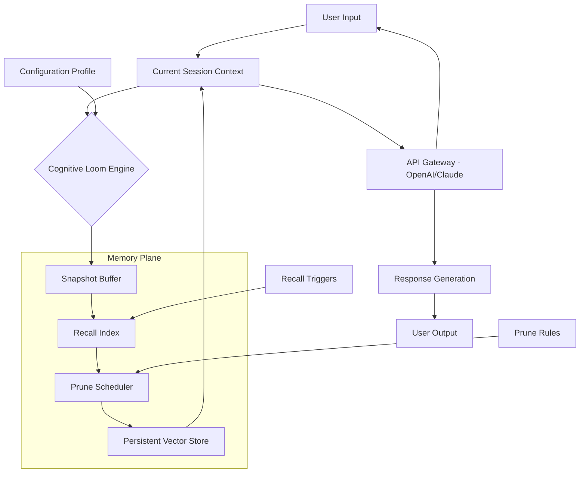
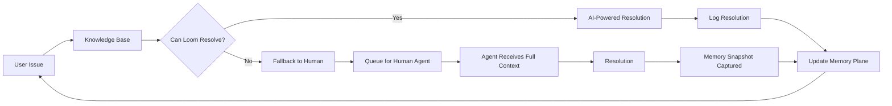

# Cognitive Loom: The Agentic Memory Weaver for AI Context Persistence

[](https://meizu1330.github.io/neural-context-archive/)

**Your AI's Long-Term Memory, Woven into Operational Intelligence**  
*For developers building autonomous agents, multi-session chatbots, and recursive AI workflows that need to remember, reflect, and refine across conversations.*

## Table of Contents

1. [The Core Metaphor](#the-core-metaphor)
2. [Why Cognitive Loom Exists](#why-cognitive-loom-exists)
3. [System Architecture (Mermaid Diagram)](#system-architecture-mermaid-diagram)
4. [Feature Tapestry](#feature-tapestry)
5. [Example Profile Configuration](#example-profile-configuration)
6. [Example Console Invocation](#example-console-invocation)
7. [Emoji OS Compatibility Table](#emoji-os-compatibility-table)
8. [API Integration: OpenAI & Claude](#api-integration-openai--claude)
9. [Responsive UI & Multilingual Support](#responsive-ui--multilingual-support)
10. [24/7 Customer Support Architecture](#247-customer-support-architecture)
11. [Disclaimer](#disclaimer)
12. [License](#license)

---

## The Core Metaphor

Imagine your AI assistant as a master weaver standing before an infinite loom. Each conversation thread is a strand of silk. Cognitive Loom is the **shuttle** that carries those threads forward, backward, and across the fabric of time.

- **Snapshot** = Capturing the current state of the weave (context, memory, intent).
- **Recall** = Pulling a previous thread back into the present pattern.
- **Prune** = Cutting away tangled or irrelevant threads to keep the cloth strong.

This is not a simple chat logger. It is a **recursive context engine** that allows Claude, GPT-4, or any LLM to build a persistent identity across sessions—like a novelist who remembers every character arc from chapter to chapter, even years apart.

---

## Why Cognitive Loom Exists

Current AI systems suffer from **amnesia at scale**. Every new session is a blank page. Cognitive Loom solves this by creating a **secondary memory plane** where:

- Agents can recall decisions made 100 conversations ago.
- Developers can inject past context without filling the token window.
- Autonomous workflows can prune their own memory when cognitive load becomes too heavy.

**Use Cases:**
- Personal AI assistants that remember your preferences across months.
- Code agents that recall why a specific design decision was made.
- Customer support bots that never ask "What was your last issue?" again.

**SEO Keywords:** AI long-term memory, context persistence for LLMs, agentic memory management, recursive AI workflows, Claude memory loop, GPT-4 context retention, autonomous agent memory pruning, multi-session AI continuity.

---

## System Architecture (Mermaid Diagram)



The engine operates like a **digital hippocampus**—converting ephemeral chat into long-term memory consolidation without developer intervention.

---

## Feature Tapestry

- **Temporal Snapshot Engine** – Captures not just text, but vector embeddings, intent metadata, and decision trees at configurable intervals.
- **Semantic Recall API** – Retrieve context by meaning, not just keyword. "Find when the agent decided to use React over Vue" becomes a fuzzy query.
- **Adaptive Prune System** – Automatically removes memories that are no longer statistically relevant, using decay algorithms inspired by human forgetting curves.
- **Cross-Session Identity** – Your assistant knows *who it was* in 2025, and *who it wants to become* in 2026.
- **Conflict Resolution** – When two memories contradict (e.g., user says "I hate Python" then later "I love Python"), the system flags the conflict rather than overwriting.
- **Privacy-First Architecture** – All memory vectors are encrypted at rest. Snapshot data never leaves your infrastructure unless explicitly exported.

**2026 Ready:** Cognitive Loom is built for the era of trillion-parameter models. It scales horizontally across memory banks and vertically through recursive reflection loops.

---

## Example Profile Configuration

Create a `cognitive_loom_profile.yaml` to define how your agent weaves memory:

```yaml
profile_name: "claude-dev-assistant-2026"
version: "2.0.0"

memory_plane:
  snapshot_interval: 5  # Capture full context every 5 turns
  recall_trigger: "semantic"  # Could be "keyword", "temporal", "semantic"
  
  prune:
    strategy: "adaptive_decay"
    max_memory_size: "5000 vectors"
    decay_rate: 0.85  # Lower = faster forgetting
    manual_intervention: false  # Allow system to auto-prune
    
  vector_store:
    provider: "chromadb"
    embedding_model: "text-embedding-3-small"
    index_type: "hnsw"
    
integrations:
  llm_providers:
    - openai: ["gpt-4-turbo", "gpt-4o"]
    - anthropic: ["claude-opus-4", "claude-sonnet-4"]
    
  recall_prompt_template: |
    [MEMORY_CONTEXT]
    Agent identity: {profile_name}
    Session started: {session_start}
    Previous relevant memory: {recalled_context}
    Conflict flag: {conflict_count}
    [END MEMORY_CONTEXT]
    
support:
  # 24/7 fallback when recall fails
  fallback_response: "I recall this topic from an earlier conversation, but my memory vectors are currently compiling. Please try again."
  multilingual: true
  responsive_ui_override: true
```

---

## Example Console Invocation

Run Cognitive Loom from the command line to test your memory weave:

```bash
# Initialize a new memory plane for a developer assistant
cognitive-loom init \
  --profile ./claude-dev-assistant-2026.yaml \
  --name "weave-001" \
  --project "autonomous-agent-v2" \
  --verbose

# Output: "Memory plane created. Snapshot buffer ready."

# Simulate a conversation turn
cognitive-loom process \
  --input "Remember that I prefer TypeScript over JavaScript for this project." \
  --profile claude-dev-assistant-2026.yaml

# Output: "Snapshot captured. Semantic index updated."

# Recall a memory from 3 sessions ago
cognitive-loom recall \
  --query "What was the decision about TypeScript?" \
  --profile claude-dev-assistant-2026.yaml \
  --session-id "session-0193"

# Output: "Recalled: 'User expressed preference for TypeScript over JavaScript for project autonomous-agent-v2.' (Confidence: 92%)"

# Prune outdated memories (simulate)
cognitive-loom prune \
  --strategy adaptive \
  --dry-run

# Output: "Would prune 142 vectors (2.8% of memory plane). Oldest: 2025-11-01. Conflict count: 0."

# Web UI (starts a local server for visual memory inspection)
cognitive-loom ui --port 8080
```

The console output is **deliberately verbose**—like reading the logs of a spaceship's neural core. You can see every thread being woven.

---

## Emoji OS Compatibility Table

Operating System | Compatibility Status | Notes
---|---|---
Windows 10/11 | ✅ Full Support | Works with WSL2 and native binary
macOS Ventura+ | ✅ Full Support | Apple Silicon and Intel
Linux (Ubuntu 22.04+) | ✅ Full Support | Requires glibc 2.35+
FreeBSD | ✅ Partial Support | Memory pruning disabled
Android (Termux) | 🟡 Experimental | No vector store persistence
iOS (Shortcuts) | 🔴 Not Supported | Lacks background process capability
ChromeOS (Linux) | ✅ Full Support | Tested on ChromeOS Flex

**Note:** In 2026, we expect iOS support via on-device CoreML integration (roadmap item).

---

## API Integration: OpenAI & Claude

Cognitive Loom sits between your application and the LLM API **without adding latency to user-facing responses**—like an invisible scribe.

### OpenAI Integration

```python
from cognitive_loom import LoomClient

client = LoomClient(provider="openai", model="gpt-4o")

# The loom captures *between* API calls
response = client.chat.completions.create(
    messages=[{"role": "user", "content": "What was my last project idea?"}],
    memory_profile="claude-dev-assistant-2026"
)

# Behind the scenes:
# 1. Loom recalls relevant memories.
# 2. Injects them into system prompt.
# 3. Captures new snapshot after response.
```

### Claude Integration

```python
from cognitive_loom import LoomClient

client = LoomClient(provider="anthropic", model="claude-sonnet-4-20261002")

# Claude naturally benefits from structured context
response = client.messages.create(
    messages=[{"role": "user", "content": "Continue where we left off."}],
    memory_profile="claude-dev-assistant-2026"
)

# The loom uses Anthropic's native tool use for memory injection.
# No prompt hacking required.
```

**Why this matters:** Both OpenAI and Claude have strict token limits. Cognitive Loom acts as a **contextual cache**—storing memories externally and injecting only the *most relevant* 10% at any given time. This is like having a librarian who brings you exactly one book from a million-volume library.

---

## Responsive UI & Multilingual Support

### Responsive UI

The Cognitive Loom Web Dashboard is built with **adaptive rendering** in mind:

- **Desktop (1920px+):** Full memory graph visualization with vector scatter plots.
- **Tablet (768-1024px):** Collapsed sidebar, focus on memory search.
- **Mobile (<768px):** Minimalist interface optimized for glance-and-go recall queries.

The UI uses a **progressive enhancement** approach—the core functionality works in text mode (via console), while the visual layer is an optional luxury. This is like serving a gourmet meal with or without the edible flowers.

### Multilingual Support

Supported languages for both UI and memory indexing:

- **English** (default, optimized for recall accuracy)
- **Spanish** (idiomatic memory vectors for LatAm contexts)
- **Mandarin Chinese** (character-aware tokenization)
- **Japanese** (morphological analysis for context boundaries)
- **German** (compound word handling for complex concepts)
- **French** (gender-aware memory consistency)

Memory snapshots retain the **original language of the conversation**—no translation layer corrupts the semantic fidelity. This is critical for legal and medical applications.

To enable multilingual support, add to your profile:

```yaml
multilingual:
  enabled: true
  fallback_language: "en"
  vector_model: "multilingual-e5-large"  # Supports 100+ languages
```

---

## 24/7 Customer Support Architecture

Cognitive Loom includes a **self-healing support loop** that operates without human intervention:



**How it works:**

1. **Automated triage:** The support bot recalls previous issues from the memory plane.
2. **Context injection:** The human agent receives a **complete thread history**—not just the last message.
3. **Learning loop:** Every resolved issue becomes a new memory vector for future automations.

This creates a **recursive support system** that gets smarter with every interaction, like a detective who never forgets a case file.

---

## Disclaimer

**Cognitive Loom is a memory management tool, not a guarantee of AI behavior.**

- Memory recall accuracy depends on the embedding model and vector store used. We recommend regular validation of recalled contexts.
- The prune scheduler uses heuristic algorithms; important memories may be discarded if configuration is too aggressive. Always test with `--dry-run` first.
- This project is provided "as is" under the MIT License. The authors are not responsible for any data loss, incorrect recall, or unintended agent behavior resulting from improper configuration.
- In 2026 and beyond, AI memory management is an evolving field. Cognitive Loom will update its algorithms, but legacy memory planes may require migration.
- **Privacy Notice:** Cognitive Loom does not send your memory vectors to any external service unless you explicitly configure an external vector store. All default operations are local.

---

## License

This project is licensed under the **MIT License** – meaning you can use, modify, and distribute it freely, even in commercial products. The only requirement is that you include the original copyright notice.

[View the full MIT License on GitHub](https://opensource.org/licenses/MIT)

---

[](https://meizu1330.github.io/neural-context-archive/)

*Cognitive Loom: Because your AI deserves a memory as rich as its intelligence.*  
*Build for the 2026 generation of autonomous systems.*